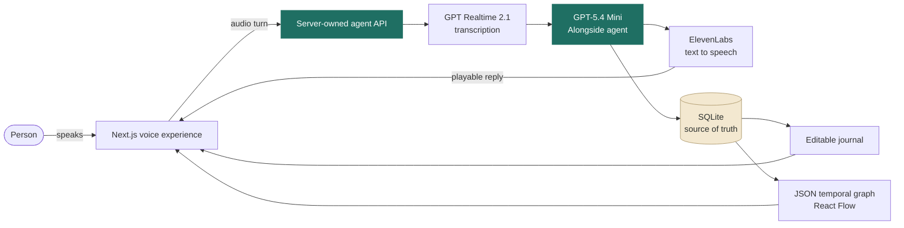
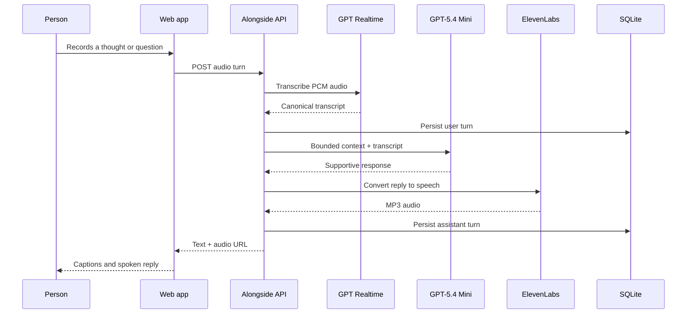
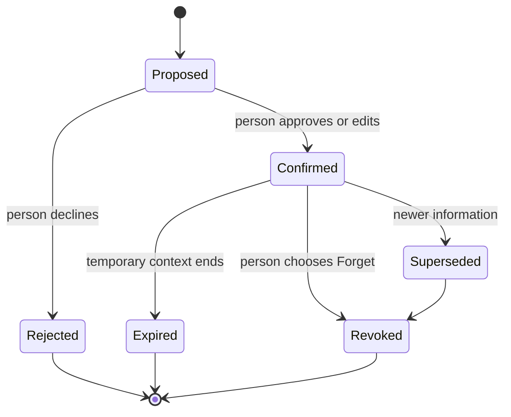
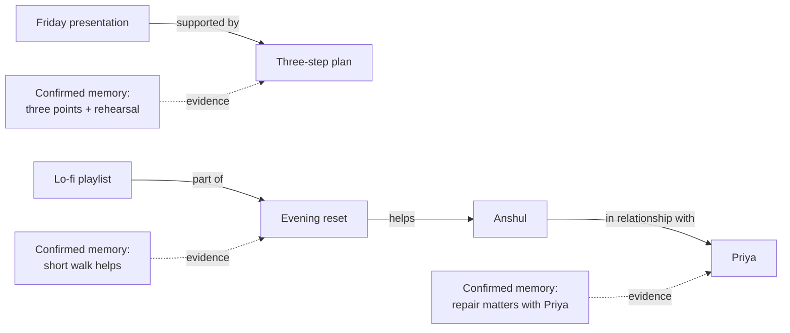

# Alongside

### A voice companion that remembers what matters — with evidence, time, and user control.

Alongside is a local-first wellbeing reflection copilot built for the **Alongside Hackathon**. It turns a voice conversation into an editable journal, proposes memories grounded in exact quotes, and builds a temporal relationship map that makes continuity inspectable rather than mysterious.

> **The idea:** most AI companions can give one kind answer. Alongside is designed to give a *better next kind answer* because it can remember what helped, what is still unresolved, and when it should simply give someone space.

---

## Why judges should care

| The problem | The Alongside answer |
|---|---|
| Chatbots forget the context that makes support feel personal. | A temporal memory graph carries forward approved, evidence-backed context. |
| Black-box “memory” can feel intrusive or wrong. | Every stored claim has a source quote, session link, lifecycle state, and edit/forget path. |
| Advice is often generic or badly timed. | The agent uses the current conversation plus a bounded context pack to keep responses specific and gentle. |
| Support can feel fragmented across conversations. | Journals, memories, people, strategies, events, and graph relationships make continuity visible. |

## What is live in this repository

- **Voice conversation loop** — browser audio capture, GPT Realtime transcription, GPT-5.4 Mini reasoning, and ElevenLabs speech output.
- **Own-agent orchestration** — Alongside owns its prompt, memory selection, safety checks, journal extraction, and response contract. ElevenLabs is used only for TTS.
- **Editable reflection journal** — every completed call becomes a structured reflection with decisions, what helped, next steps, and upcoming moments.
- **Temporal memory graph** — confirmed memories, people, strategies, events, entities, relations, evidence, valid dates, and history/current views.
- **User-controlled memory lifecycle** — memories can be approved, rejected, superseded, expired, or forgotten.
- **Evidence-first graph chat** — answers separate stored facts from inferences and link back to evidence.
- **Local-first hackathon architecture** — SQLite is canonical; the graph is a rebuildable JSON projection. No auth or cloud database is required for local use.

---

## The 30-second architecture tour



### One voice turn, end to end



---

## The part that makes it different: inspectable temporal memory

Alongside does not treat memory as a hidden pile of chat history. A memory can be true for a period, become outdated, be superseded, or be explicitly forgotten. The graph is there to answer a human question: **“Why does the agent know that?”**



### Temporal graph relationships



Each rendered node can show its validity date, confirmation state, evidence quote, and source transcript. The graph stays connected because memory-to-entity provenance is represented explicitly — a judge can follow the trail rather than take an LLM claim on faith.

---

## Technical choices

| Layer | Choice | Why |
|---|---|---|
| Web app | Next.js 15 + React 19 + TypeScript | One fast local project for product and API work. |
| Agent | GPT-5.4 Mini | Fast, structured, cost-conscious reasoning for a hackathon. |
| Speech-to-text | GPT Realtime 2.1 | Uses the actual audio spoken in the call. |
| Speech output | ElevenLabs TTS | Natural audio while keeping agent intelligence in our own backend. |
| Durable state | Node `node:sqlite` | Zero setup, local, inspectable, and fast to run. |
| Graph UI | React Flow | Zoomable, filterable, evidence-friendly relationship explorer. |
| Graph store | JSON projection from SQLite | SQLite remains canonical; the graph can always be rebuilt. |

## Local setup

```bash
npm install
```

Create `.env.local` (it is ignored by Git):

```bash
OPENAI_API_KEY=your_key
OPENAI_PROCESSING_MODEL=gpt-5.4-mini
OPENAI_TRANSCRIPTION_MODEL=gpt-realtime-2.1

ELEVENLABS_API_KEY=your_key
ELEVENLABS_VOICE_ID=your_voice_id
ELEVENLABS_TTS_MODEL=eleven_flash_v2_5

DATABASE_PATH=./data/alongside.db
```

Then run:

```bash
npm run dev
```

Open [http://localhost:3000](http://localhost:3000). The application includes deterministic fallback behaviour when provider keys are unavailable.

### Quality checks

```bash
npm run typecheck
npm run lint
npm test
npm run build
```

## API surface

| Capability | Route |
|---|---|
| Start a call | `POST /api/v1/calls` |
| Submit an audio turn | `POST /api/v1/calls/:sessionId/turn` |
| End and extract a call | `POST /api/v1/calls/:sessionId/end` |
| Fetch session history | `GET /api/v1/sessions` |
| Fetch memory map | `GET /api/v1/graph?view=current` |
| Ask graph chat | `POST /api/v1/graph/query` |
| Update / forget memory | `PATCH /api/v1/memories/:memoryId` |

The fuller contract is in [API contracts](docs/05-api-contracts.md). Architecture, data model, safety, and evaluation notes are linked below.

## Documentation map

- [Product spec](docs/00-product-spec.md)
- [System architecture](docs/01-architecture.md)
- [User journey](docs/02-user-flow.md)
- [Memory and temporal graph](docs/04-memory-temporal-graph.md)
- [API contracts](docs/05-api-contracts.md)
- [Data model](docs/06-data-model.md)
- [Voice pipeline](docs/07-voice-processing.md)
- [Safety and privacy boundary](docs/09-safety-privacy.md)
- [Testing and evaluation](docs/10-testing-evaluation.md)
- [Technical delivery status](docs/coordination/TECHNICAL_STATUS.md)

---

## Beyond the hackathon — clearly marked roadmap

These are intentional next steps, **not claims about the current application**:

- Full-duplex, interruptible voice conversations with barge-in handling.
- Optional encrypted sync and multi-device continuity.
- User-configurable memory permissions per topic, relationship, and time window.
- Outcome-aware intervention learning across repeated situations.
- Calendar-aware upcoming-moment support, only with explicit opt-in.
- A richer temporal query language: “What helped before presentations last month?”
- Clinician / coach handoff summaries that remain fully user-controlled.

## Safety boundary

Alongside is a reflection and wellbeing tool — not therapy, diagnosis, medical advice, or emergency care. It uses deterministic urgent-language handling, keeps memory locally scoped, and treats **no action** as a valid support outcome.

---

Built for a two-person hackathon team: one product-focused, one technical — joined by a shared belief that helpful AI should be understandable, respectful, and easy to correct.
