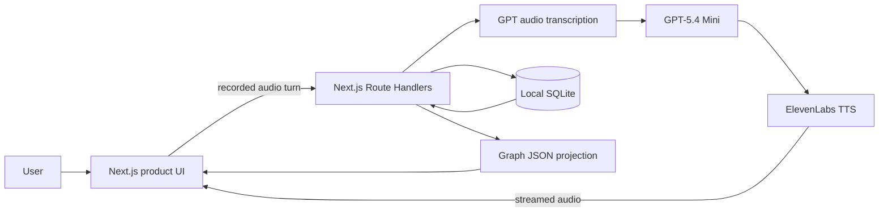

# System architecture

## Chosen hackathon architecture

Alongside is a local-first Next.js application with a deliberately small provider surface:

- **Next.js App Router + TypeScript** for UI and server Route Handlers.
- **Browser `MediaRecorder`/Web Audio** for turn-based microphone capture.
- **GPT-5.4 Mini** through the event's OpenAI-compatible gateway for live responses, structured post-call extraction, graph questions, and policy explanations.
- **GPT audio transcription** as the preferred post-turn/post-call transcript source, with the provider transcript as an explicit fallback.
- **ElevenLabs Text-to-Speech only** for spoken assistant replies, streamed from server routes.
- **Node's built-in SQLite (`node:sqlite`)** for local durable state.
- **JSON graph projection** generated from SQLite records for React Flow (`@xyflow/react`) and written to `data/temporal-graph.json` for local inspection.

There is no authentication, hosted database, vector search, background queue, or deployment requirement for the hackathon demo.

## Component flow



## Turn lifecycle

```text
ready
→ recording
→ transcribing
→ thinking
→ speaking
→ ready
```

The browser records one user turn and sends it to `POST /api/v1/calls/{sessionId}/turn`. The server transcribes it, builds a bounded context pack, asks GPT-5.4 Mini for a short answer, requests ElevenLabs TTS, persists both transcript turns, and returns the text plus a playable audio URL or stream. Full-duplex barge-in is intentionally out of scope.

## Post-call lifecycle

```text
call_completed
→ transcribing
→ extracting
→ awaiting_user_review
→ ready | failed
```

GPT proposes a journal, upcoming moments, state observations, interventions, and candidate memories. Application code validates the output. The user confirms durable memory before it becomes a graph projection.

## Memory and graph rules

- SQLite is the source of truth.
- The graph is a rebuildable JSON projection, never a second independent database; SQLite remains canonical.
- Store valid time and system time separately.
- Revoked, rejected, expired, or superseded records are excluded from current retrieval.
- Every graph node and edge carries evidence IDs, source session, explicit/inferred state, confidence, sensitivity, and permission.
- JSON fixtures are allowed only for seed/demo fallback.

## Directory architecture

```text
app/
├── (product)/                 # Product-owned pages and layouts
│   ├── dashboard/
│   ├── call/
│   ├── calls/[id]/
│   ├── journal/
│   ├── graph/
│   └── settings/
└── api/v1/                    # Technical-owned Route Handlers

components/                    # Product-owned components
lib/client/                    # Product-owned API clients and view models
lib/mock-data/                 # Product-owned contract mocks
lib/server/                    # SQLite, AI, TTS, memory, and policy
data/                          # Ignored local SQLite/audio runtime data
tests/backend/                 # Technical-owned tests
tests/frontend/                # Product-owned tests
```

## Environment variables

```bash
OPENAI_API_KEY=
OPENAI_BASE_URL=
OPENAI_PROCESSING_MODEL=gpt-5.4-mini
OPENAI_TRANSCRIPTION_MODEL=gpt-audio

ELEVENLABS_API_KEY=
ELEVENLABS_VOICE_ID=
ELEVENLABS_TTS_MODEL=eleven_flash_v2_5

DATABASE_PATH=./data/alongside.db
DEMO_USER_ID=demo-user
DEMO_MODE=true
```

Never expose server keys through `NEXT_PUBLIC_*` variables. The browser receives only session data, transcript text, and playable audio responses.

## Reliability decisions

- Audio and TTS failures are recoverable; the UI can continue in text/mock fallback mode.
- GPT structured output is validated locally and retried once.
- Every call turn has a stable session/turn ID and is safe to retry without duplicating transcript rows.
- Journal and candidate-memory extraction is resumable and never invents a journal when transcription fails.
- The graph can be regenerated from SQLite.
- Seeded demo data keeps the presentation usable when provider latency or network access fails.
