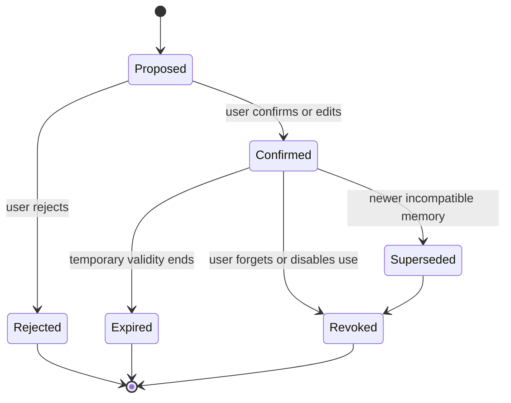

# Memory and temporal graph design

## Why this is not “chat history plus embeddings”

Alongside separates recent context, episodes, stable facts, temporary states, interventions, outcomes, boundaries, and revocations. Retrieval must account for time, provenance, permission, contradiction, and current relevance.

## Memory layers

1. **Working context**: current call only.
2. **Session memory**: call summary, decisions, open threads.
3. **Episodic memory**: events and moments.
4. **Semantic memory**: confirmed preferences, values, relationships.
5. **State snapshots**: time-limited mood/energy/receptivity observations.
6. **Intervention ledger**: suggestions and outcomes.
7. **Relationship/support graph**: people and support roles.
8. **Negative memory**: forbidden topics, revoked facts, rejected suggestions.

## Memory lifecycle



A revoked memory must be excluded from semantic search, graph traversal, summaries, caches, and graph-chat evidence.

## Temporal model

Store both:

- **Valid time**: when the fact was true in the user’s life.
- **System time**: when the application learned, changed, or invalidated it.

Example:

```text
Preference: morning check-ins welcome
valid_from: 2026-07-10
valid_to:   2026-07-22
learned_at: 2026-07-10
invalidated_at: 2026-07-22

Preference: no morning check-ins
valid_from: 2026-07-22
valid_to:   null
learned_at: 2026-07-22
```

Do not overwrite history. Close validity and create a new record.

## Core graph nodes

- User
- Session
- JournalEntry
- Event
- Person
- Value
- Goal
- Activity
- CopingStrategy
- SupportMode
- Intervention
- Outcome
- Preference
- Boundary
- StateSnapshot
- UpcomingMoment

## Core edges

- `EXPERIENCED`
- `INVOLVED`
- `OCCURRED_BEFORE`
- `CONTRIBUTED_TO`
- `VALUES`
- `EXPRESSES`
- `SUPPORTS`
- `OFFERED_DURING`
- `TARGETED`
- `PRODUCED`
- `PREFERS`
- `AVOIDS`
- `PROVIDES_SUPPORT_TYPE`
- `RELATES_TO`
- `SUPERSEDES`
- `CONTRADICTS`
- `DERIVED_FROM`
- `BLOCKS`

## Provenance requirements

Every user-facing graph claim must be traceable to:

- source session;
- source transcript segment or journal edit;
- extraction method;
- explicit vs inferred status;
- confidence;
- confirmation status;
- valid period;
- reuse permission.

## Candidate extraction schema

```json
{
  "type": "coping_strategy",
  "statement": "Music helped before a medical appointment",
  "source_quote": "Having my playlist on made the journey easier",
  "source_session_id": "session_01",
  "explicitness": "explicit",
  "confidence": 0.91,
  "temporal_scope": "context_specific_recurring",
  "sensitivity": "medium",
  "suggested_expiry_days": 90,
  "reuse_permission": "ask_first"
}
```

## Write pipeline

```text
Call complete
→ canonical transcript
→ strict extraction
→ candidate validation
→ contradiction/supersession search
→ proposed journal and memories
→ user review
→ confirmed records
→ graph projection and embedding
```

The LLM proposes. Application code validates. The user confirms sensitive durable memory.

## Retrieval pipeline

### Hard filters

Exclude:

- revoked/rejected records;
- expired temporary records;
- superseded records in current-view mode;
- disallowed sensitive records;
- unrelated third-party detail;
- memories blocked by a boundary.

### Candidate generation

Combine:

- entity overlap;
- graph neighbourhood;
- semantic similarity;
- temporal proximity;
- active event relevance;
- support-mode relevance;
- intervention-outcome similarity.

### Ranking

```text
score =
  semantic_similarity * 0.25
+ entity_overlap       * 0.20
+ temporal_relevance   * 0.15
+ current_goal_fit     * 0.15
+ user_confirmation    * 0.10
+ outcome_relevance    * 0.10
+ recurrence           * 0.05
- sensitivity_penalty
- staleness_penalty
- contradiction_penalty
```

Weights are MVP heuristics, not clinical constants.

### Runtime context pack

Return only a bounded, inspectable pack:

```json
{
  "requested_mode": "practical",
  "active_events": [],
  "relevant_memories": [],
  "boundaries": [],
  "intervention_history": [],
  "uncertainties": [],
  "response_policy": {
    "reflect_before_advice": true,
    "max_questions_per_turn": 1
  }
}
```

## Graph visualisation

Use React Flow with custom node types.

### Visual semantics

- Solid border: confirmed fact.
- Dashed border: model inference.
- Faded node: superseded or historical.
- Lock indicator: sensitive/ask-first.
- Broken-link indicator: revoked and hidden from default view.
- Edge label includes predicate and validity period.

Do not rely on colour alone; include icons and text for accessibility.

### User interactions

- Pan, zoom, mini-map.
- Filter by node type and date.
- Toggle current/history.
- Select node to inspect evidence.
- Jump to source transcript.
- Edit/forget.
- Ask graph chat about selected nodes.

## Graph-chat design

The graph-chat agent receives only permitted retrieved evidence, never unrestricted database access.

Response schema:

```json
{
  "answer": "Music has helped before two appointment-related journeys.",
  "facts": [
    {"text": "Music helped before the July 24 appointment", "evidence_ids": ["mem_1"]}
  ],
  "inferences": [
    {"text": "Music may be useful in similar anticipatory contexts", "evidence_ids": ["mem_1", "outcome_2"], "confidence": 0.72}
  ],
  "uncertainty": "Only two relevant examples are stored.",
  "abstained": false
}
```

The system must explicitly distinguish direct fact from inference and may abstain.

## Forgetting semantics

“Forget” means:

1. mark source memory revoked;
2. remove active graph projection;
3. remove embedding or exclude it by hard filter;
4. invalidate cached context packs;
5. exclude from graph chat;
6. preserve only the minimum tombstone required to prevent accidental resurrection, without retaining the sensitive content.
