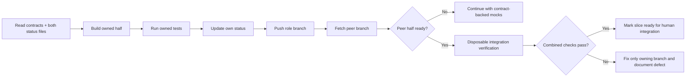

# Integration loop

## Purpose

Keep two Codex agents building matching halves without overlapping files or discovering incompatibility at the end.

## Loop

## Status files

- Technical agent writes only `TECHNICAL_STATUS.md`.
- Product agent writes only `PRODUCT_STATUS.md`.
- Each reads the peer file directly from the peer remote branch.

## Request files

- Technical requests product changes in `REQUESTS_FROM_TECHNICAL.md`.
- Product requests contract/backend changes in `REQUESTS_FROM_PRODUCT.md`.
- Requests must identify slice, desired behaviour, contract impact, and urgency.

## Ready states

Use exactly:

- `NOT_STARTED`
- `IN_PROGRESS`
- `BLOCKED`
- `READY_FOR_INTEGRATION`
- `INTEGRATED`

## Integration failures

Do not patch peer-owned files to make a temporary combined branch pass. Record:

- failing command;
- error output summary;
- likely owning branch;
- contract mismatch;
- minimal requested fix.

## Shared mock strategy

Product UI uses contract-backed mocks until real endpoints exist. The client adapter switches between mock and real implementations through `DEMO_MODE`, not through component rewrites.
