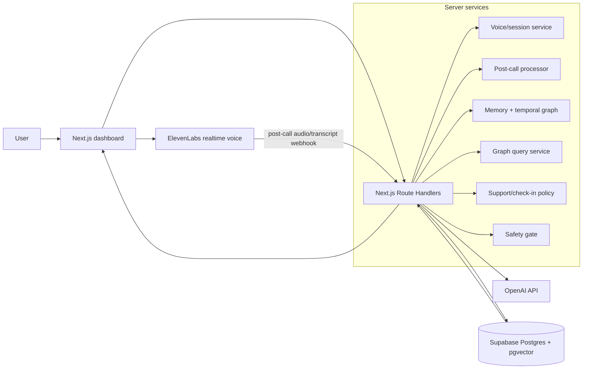
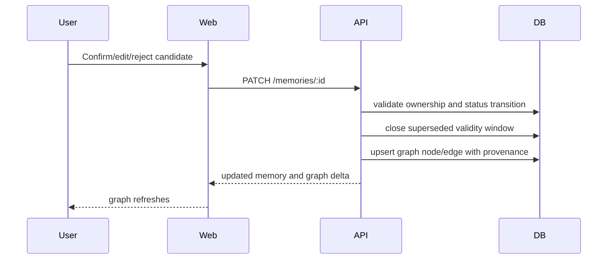
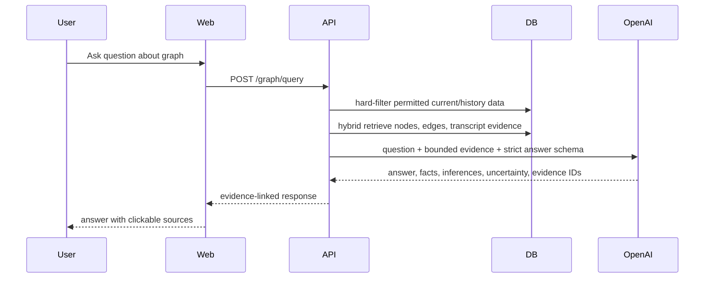

# System architecture

## Chosen hackathon architecture

A single TypeScript repository keeps integration cheap while preserving clear ownership:

- **Next.js App Router** for UI and server Route Handlers.
- **ElevenLabs Agents React SDK** for realtime browser voice over WebRTC.
- **OpenAI API** for canonical post-call transcription, structured journal/memory extraction, embeddings, moderation support, and graph-chat responses.
- **Supabase Postgres** for durable data, row-level security, and pgvector.
- **React Flow (`@xyflow/react`)** for graph visualisation.

## Component diagram



## Call lifecycle

```mermaid
sequenceDiagram
    participant User
    participant Web
    participant ElevenLabs
    participant API
    participant OpenAI
    participant DB

    User->>Web: Start call
    Web->>API: POST /voice/token
    API-->>Web: short-lived conversation token
    Web->>ElevenLabs: startSession(token, user/session vars)
    ElevenLabs-->>Web: realtime audio and provisional messages
    User->>Web: End call
    ElevenLabs->>API: signed post-call webhook
    API->>DB: create/update session; store webhook receipt
    API->>OpenAI: canonical transcription from short-lived audio
    OpenAI-->>API: transcript
    API->>OpenAI: strict structured journal/memory extraction
    OpenAI-->>API: journal + candidates + state + interventions
    API->>DB: persist transcript, journal, proposed memories
    API-->>Web: processing complete
    Web-->>User: editable journal and memory approvals
```

## Memory approval and graph update



## Graph-chat lifecycle



## Directory architecture

```text
app/
├── (product)/                 # Product-owned pages and layouts
│   ├── dashboard/
│   ├── calls/[id]/
│   ├── journal/
│   ├── graph/
│   └── settings/
└── api/v1/                    # Technical-owned Route Handlers

components/                    # Product-owned components
lib/client/                    # Product-owned API clients and view models
lib/server/                    # Server utilities
lib/ai/                        # OpenAI clients, prompts, schemas
lib/memory/                    # versioning, retrieval, graph mapping
lib/safety/                    # safety classifiers and policy
supabase/migrations/           # technical-owned migrations
packages/contracts/            # optional generated contract package
```

## Environment variables

```bash
NEXT_PUBLIC_APP_URL=
NEXT_PUBLIC_SUPABASE_URL=
NEXT_PUBLIC_SUPABASE_ANON_KEY=
SUPABASE_SERVICE_ROLE_KEY=

ELEVENLABS_API_KEY=
ELEVENLABS_AGENT_ID=
ELEVENLABS_WEBHOOK_SECRET=

OPENAI_API_KEY=
OPENAI_PROCESSING_MODEL=
OPENAI_TRANSCRIPTION_MODEL=gpt-4o-transcribe
OPENAI_EMBEDDING_MODEL=text-embedding-3-small

DEMO_USER_ID=
DEMO_MODE=true
```

Never expose server keys through `NEXT_PUBLIC_*` variables.

## Reliability decisions

- Webhooks are authenticated and idempotent.
- Post-call processing runs as a resumable state machine: `received → transcribing → extracting → ready | failed`.
- Journal and candidate memory schemas are strict JSON schemas.
- OpenAI model IDs are environment-configured and can be pinned.
- The graph is derived from approved source records and can be rebuilt.
- Full transcripts are never injected into every call. The runtime receives a bounded context pack.
- Demo seed data exists so the presentation survives provider latency.
